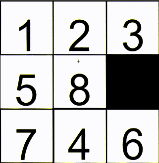

# Number Slider Puzzle
A simple 3x3 Number Slider Puzzle game based on OpenCV.

  
## Build requirements
1. CMake
2. OpenCV Release

  
## How to build
Make sure you **modified the 'OpenCV_DIR' in CMakeLists**.  

```bash
cd build
cmake -G "MinGW Makefiles" ..
make
```
  
  It also supports MSVC.
  
## Additional
I don't work as a programmer, this is a learning-oriented project.
  
  Enjoy.
